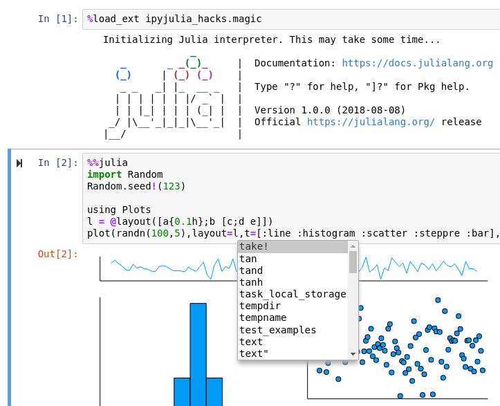
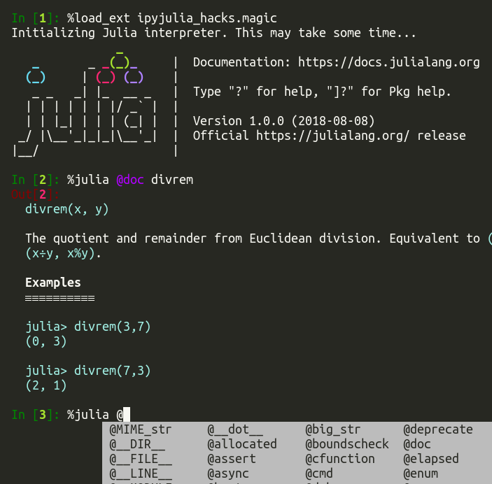

==============================================
 Horrible hacks for Julia-IPython integration
==============================================

|build-status|

Screenshots
===========

Features
========

* `Julia's Multimedia I/O`_ hooked into `IPython's display system`_
* Code completion inside Julia magic (by **monkey-patching** IPython)
* Copy-free access to Julia objects from IPython

Those are build on top of the great libraries PyCall.jl_ and PyJulia_.
(It would be great to some features to PyJulia_ at some point.  But I
wanted to experiment how to bridge Julia and Python worlds.)

.. _PyJulia: https://github.com/JuliaPy/pyjulia
.. _PyCall.jl: https://github.com/JuliaPy/PyCall.jl
.. _`Julia's Multimedia I/O`:
   https://docs.julialang.org/en/stable/base/io-network/#Multimedia-I/O-1
.. _`IPython's display system`:
   https://ipython.readthedocs.io/en/stable/config/integrating.html

Installation
============

Pretty much everything has to be installed from development version::

  pip install https://github.com/ipython/ipython/archive/master.zip#egg=ipython
  pip install https://github.com/tkf/pyjulia/archive/venv.zip#egg=julia
  pip install https://github.com/tkf/ipyjulia_hacks/archive/master.zip#egg=ipyjulia_hacks

.. budges

.. |build-status|
   image:: https://travis-ci.org/tkf/ipyjulia_hacks.svg?branch=master
   :target: https://travis-ci.org/tkf/ipyjulia_hacks
   :alt: Build Status

.. |coveralls|
   image:: https://coveralls.io/repos/github/tkf/ipyjulia_hacks/badge.svg?branch=master
   :target: https://coveralls.io/github/tkf/ipyjulia_hacks?branch=master
   :alt: Test Coverage
